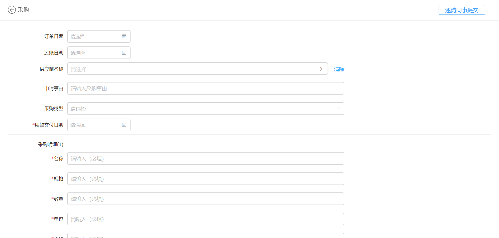
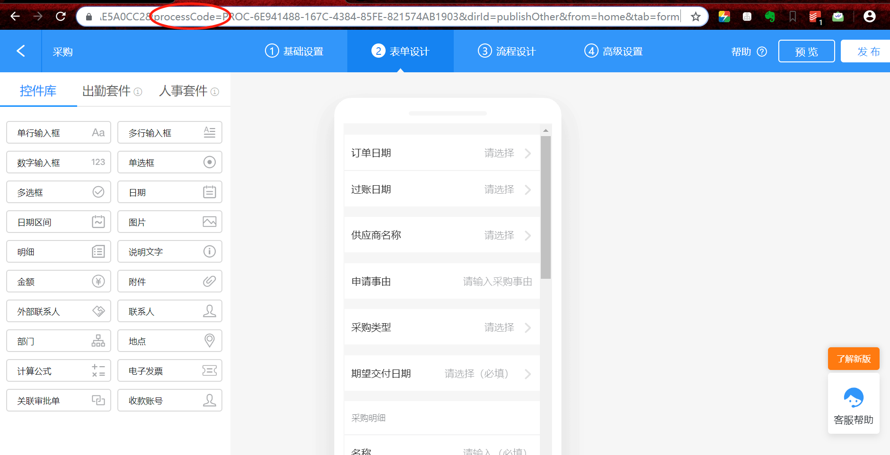
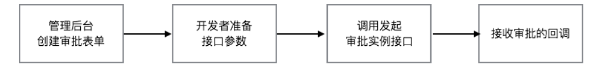
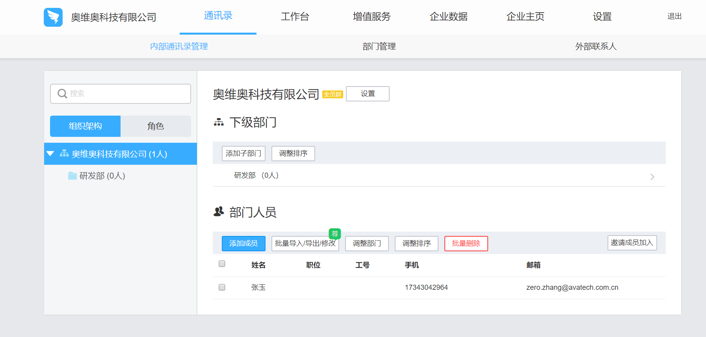
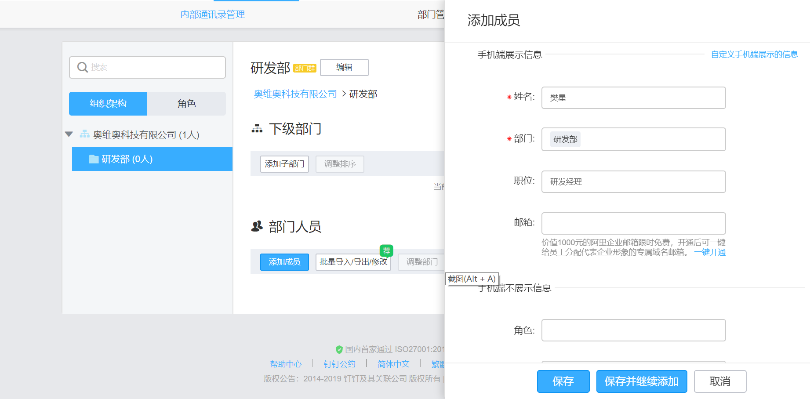
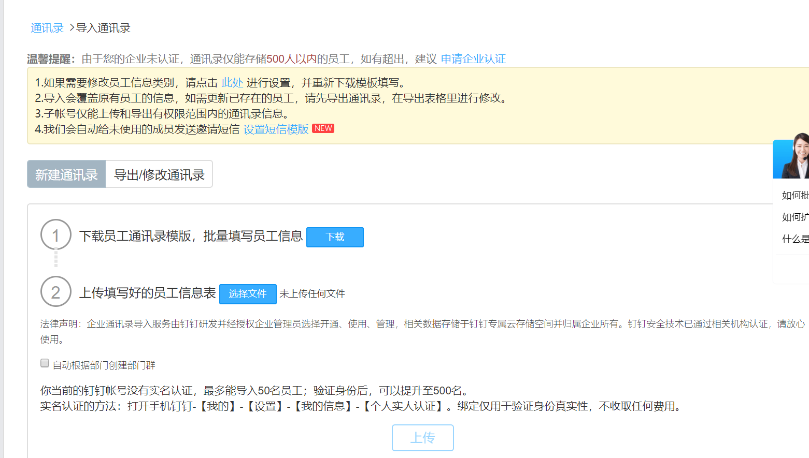
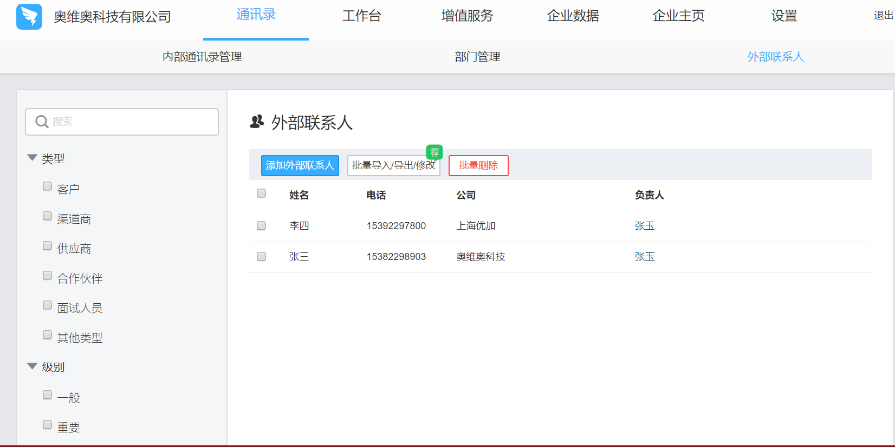

+ [sap与钉钉接入流程归纳](#sap与钉钉接入流程归纳)
    - [钉钉表单设计](#钉钉表单设计)
        + [报销表单设计](#报销表单设计)
        + [采购订单表单设计](#采购订单表单设计)
    - [审批接口](#审批接口)
        + [sap与钉钉对接审批](#sap与钉钉对接审批)
        + [基础架构](#基础架构)
        + [审批表单](#基础表单)
        + [企业接入流程](#企业接入流程)
        + [发起审批实例](#发起审批实例)
        + [批量获取审批实例id](#批量获取审批实例id)
        + [获取单个审批实例](#获取单个审批实例)
    - [主动调用频率限制](#主动调用频率限制)
    - [获取token](#获取token)
    - [主数据同步](#主数据同步)
        + [同步员工主数据](#同步员工主数据)
        + [同步部门主数据](#同步部门主数据)
        + [添加业务伙伴主数据](#添加业务伙伴主数据)
    


## sap与钉钉接入流程归纳

### 1.钉钉表单设计

#### 1.1报销表单设计

1.在报销单中增加科目选择的控件，单选控件最多支持200项


2.点击发布生成报销表单


#### 1.2采购订单表单设计



### 2.审批接口

#### 2.1 sap与钉钉对接审批

开发者将企业的erp对接到钉钉上，可以通过调用发起审批实例接口，在钉钉里生成一个审批单。

#### 2.2基础架构


#### 2.3 审批表单

每个审批流有不同的审批单，管理员可以在管理后台修改每个审批表单的样式

每个审批流都会指定一个唯一码，即process_code




#### 2.4企业接入流程



#### 2.5发起审批实例

1.请求方式：post(HTTPS)

2.请求地址：https://oapi.dingtalk.com/topapi/processinstance/create?access_token=ACCESS_TOKEN

#### 2.6批量获取审批实例id

企业通过此接口获取某个审批的实例id列表,企业可以通过审批实例id获取审批实例详情	

请求方式：post(HTTPS)

请求地址：https://oapi.dingtalk.com/topapi/processinstance/listids?access_token=ACCESS_TOKEN

#### 2.7获取单个审批实例

请求方式：post(HTTPS)

请求地址：https://oapi.dingtalk.com/topapi/processinstance/get?access_token=ACCESS_TOKEN

| 名称                | 类型   | 是否必须 | 示例值    | 描述       |
| :------------------ | :----- | :------- | :-------- | :--------- |
| process_instance_id | String | 必须     | 1a2b-3e4d | 审批实例id |

返回结果说明：

```java
{
    "errcode":0,
    "errmsg":"成功",
    "process_instance":{
        "title":"实例标题",
        "create_time":"2018-11-21 12:00:00",
        "finish_time":"2018-11-21 12:00:00",
        "originator_userid":"manager1",
        "originator_dept_id":"1",
        "status":"NEW",
        "cc_userids":"manager1,manager2",
        "form_component_values":[
            {
                    "name":"名称",
                    "value":"示例值",
                    "ext_value":"示例值"
            }
        ],
        "result":"agree",
        "business_id":"2017111111",
        "operation_records":[
            {
                    "userid":"manager1",
                    "date":"2018-11-21 12:00:00",
                    "operation_type":"EXECUTE_TASK_NORMAL",
                    "operation_result":"AGREE",
                    "remark":"评论"
            }
        ],
        "tasks":[
            {
                    "userid":"manager1",
                    "task_status":"NEW",
                    "task_result":"REDIRECTED",
                    "create_time":"2018-11-21 12:00:00",
                    "finish_time":"2018-11-21 12:00:00",
                    "taskid":"1497249"
            }
        ],
        "originator_dept_name":"测试",
        "biz_action":"MODIFY",
        "attached_process_instance_ids":"instance1,instance2"
    }
}
```

### 3.主动调用频率限制

每个企业调用单个接口的频率不可超过1500次/分


### 4.获取token

AccessToken是企业访问钉钉开放平台接口的全局唯一票据，调用接口时需携带AccessToken。

AccessToken需要用CorpID和CorpSecret来换取，不同的CorpSecret会返回不同的AccessToken。正常情况下AccessToken有效期为7200秒，有效期内重复获取返回相同结果，并自动续期。

 GET `https://oapi.dingtalk.com/gettoken?corpid=id&corpsecret=secrect`	

| 参数       | 参数类型 | 必须 | 说明               |
| ---------- | -------- | ---- | ------------------ |
| corpsecret | String   | 是   | 企业应用的凭证密钥 |
| corpid     | String   | 是   | 企业Id             |

### 5.主数据同步

#### 5.1同步员工主数据

1.以管理员身份呢进入企业后台，添加员工以及部门

#### 

2.添加员工



3.通过下载员工通讯录模板添加员工主数据



5.2同步部门主数据

1添加部门


#### 5.3添加业务伙伴主数据

业务伙伴主数据也可以通过下载模板批量上传的方式

