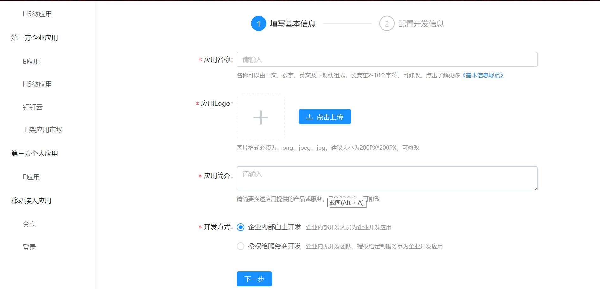
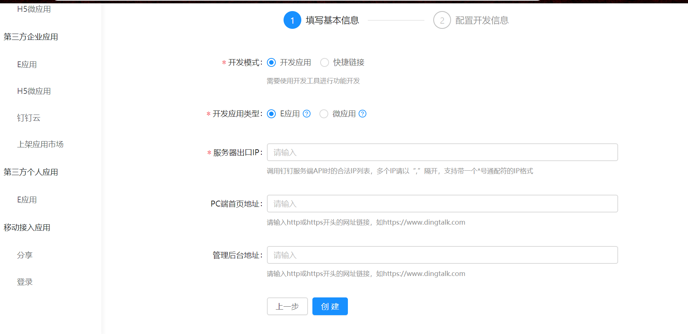
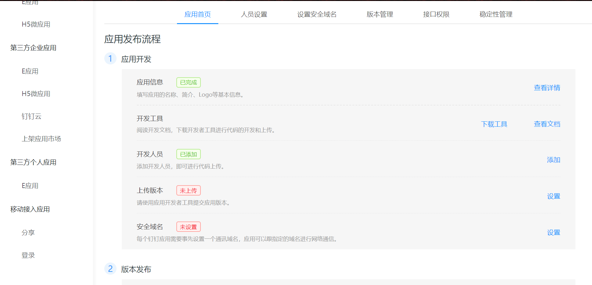
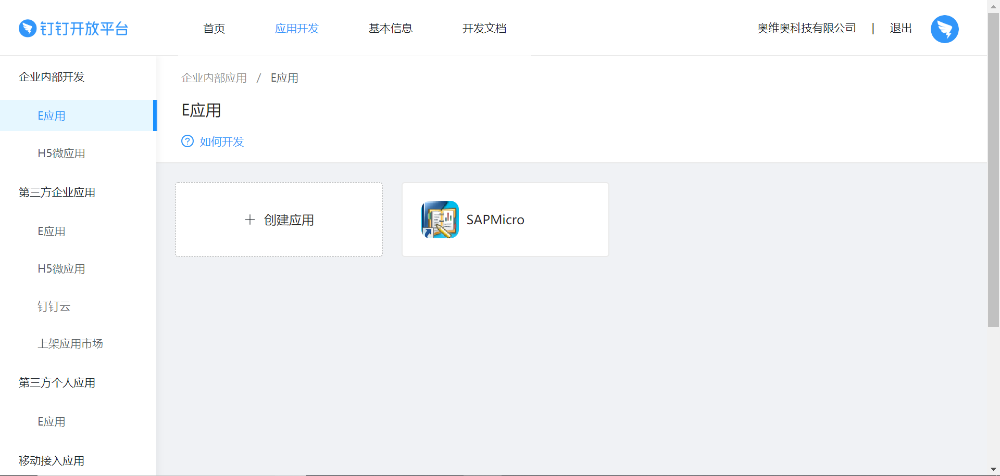
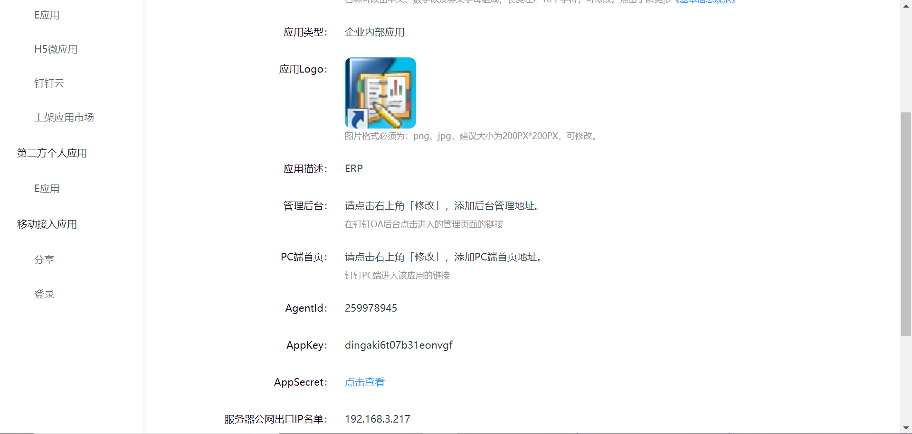

# 钉钉第三方应用开发

## 企业自主开发E应用

企业内部开发是值开发企业内部应用供企业内部人员使用。企业可以选择由企业内部的开发者进行开发，或者由企业授权定制服务商进行开发。

## 应用类型

可以开发E应用、H5应用两种类型的应用。E应用支持安卓、iso部署多端部署，暂不支持PC端部署。

PC端部署可以选择H5的方式开发应用。

## E应用和H5微应用的对比

| **E应用**            | **H5微应用**                         |                                                     |
| -------------------- | ------------------------------------ | --------------------------------------------------- |
| **加载性能**         | 首次使用略慢，后续加载快             | 受到很多因素影响，优化不够好，容易慢                |
| **使用体验**         | 非常顺滑，接近 Native                | 容易卡顿                                            |
| **页面跳转，返回**   | 和 Native 的效果一样                 | 做不到和 Native 一样的体验                          |
| **开发环境搭建**     | 提供 IDE，快速创建项目               | 成本高                                              |
| **调试**             | 提供 IDE，可以在电脑上调试大部分功能 | 在电脑上只能调 UI，涉及到钉钉的 jsapi，必须真机调试 |
| **使用开源 UI 组件** | 目前不支持                           | 支持                                                |
| **使用 npm 包**      | 支持                                 | 支持                                                |
| **模块化组织代码**   | 支持 E应用 特有的模块化              | 使用 vue, React 等框架可以轻松获得模块化支持        |
| **灰度发布**         | 钉钉提供                             | 需要自己实现                                        |
| **CDN**              | E应用包默认在 CDN                    | 需要开发者自己购买相关服务                          |
| **开发个人应用**     | 支持                                 | 不支持                                              |
| **应用离线化**       | 支持                                 | 不支持                                              |

## 创建E应用

1.登陆开发开发者后台，选择"应用开发"->"企业内部开发"->"E应用"，点击"创建应用"，开始创建企业自建E应用。填写应用基本信息。包括应用名称、应用Logo和应用简介，选择"企业内部自主开发"，点击"下一步"

2.开发模式选择“开发应用”，开发应用类型选择“E应用”，服务器出口IP填写本企业服务器的公网IP。

3.提交完成创建

4.接口权限

为了保证企业的数据安全与应用稳定，请根据应用的功能，进行合理的配置。
其中，通讯录权限，需要选择授权的范围，表示：服务商可获取哪些人员的通讯录信息。建议开发期间，根据需要合理授权。	

5.创建完E应用在后台点击已经创建的企业应用，进入应用详情页面。

6.点击查看应用详情

7.查看应用的appKey和appSecret值。

