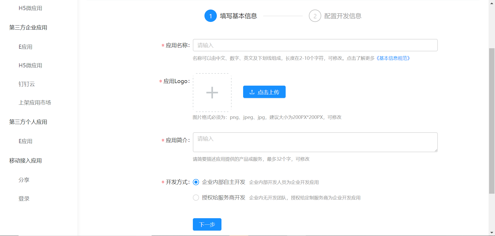
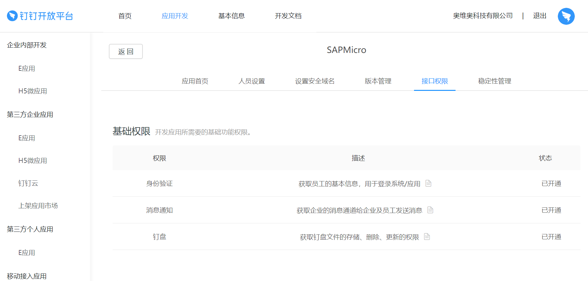
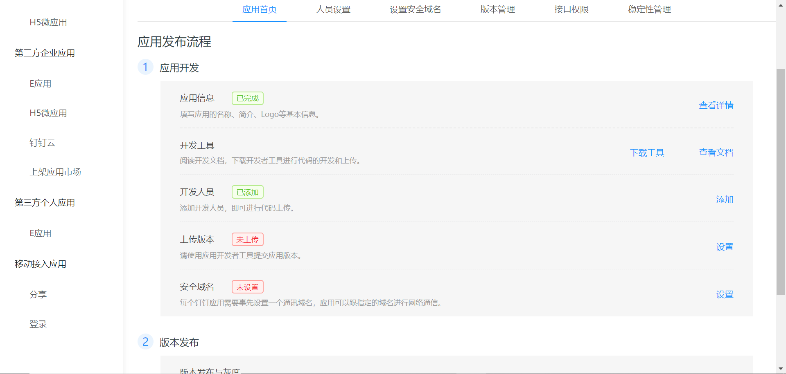

# 钉钉第三方应用开发

## 企业自主开发E应用

企业内部开发是值开发企业内部应用供企业内部人员使用。企业可以选择由企业内部的开发者进行开发，或者由企业授权定制服务商进行开发。

## 应用类型

可以开发E应用、H5应用两种类型的应用。E应用支持安卓、iso部署多端部署，暂不支持PC端部署。

PC端部署可以选择H5的方式开发应用。

## E应用和H5微应用的对比

| **E应用**            | **H5微应用**                         |                                                     |
| -------------------- | ------------------------------------ | --------------------------------------------------- |
| **加载性能**         | 首次使用略慢，后续加载快             | 受到很多因素影响，优化不够好，容易慢                |
| **使用体验**         | 非常顺滑，接近 Native                | 容易卡顿                                            |
| **页面跳转，返回**   | 和 Native 的效果一样                 | 做不到和 Native 一样的体验                          |
| **开发环境搭建**     | 提供 IDE，快速创建项目               | 成本高                                              |
| **调试**             | 提供 IDE，可以在电脑上调试大部分功能 | 在电脑上只能调 UI，涉及到钉钉的 jsapi，必须真机调试 |
| **使用开源 UI 组件** | 目前不支持                           | 支持                                                |
| **使用 npm 包**      | 支持                                 | 支持                                                |
| **模块化组织代码**   | 支持 E应用 特有的模块化              | 使用 vue, React 等框架可以轻松获得模块化支持        |
| **灰度发布**         | 钉钉提供                             | 需要自己实现                                        |
| **CDN**              | E应用包默认在 CDN                    | 需要开发者自己购买相关服务                          |
| **开发个人应用**     | 支持                                 | 不支持                                              |
| **应用离线化**       | 支持                                 | 不支持                                              |

## 创建E应用

1.登陆开发开发者后台，选择"应用开发"->"企业内部开发"->"E应用"，点击"创建应用"，开始创建企业自建E应用。填写应用基本信息。包括应用名称、应用Logo和应用简介，选择"企业内部自主开发"，点击"下一步"

2.开发模式选择“开发应用”，开发应用类型选择“E应用”，服务器出口IP填写本企业服务器的公网IP。

3.提交完成创建

4.接口权限

为了保证企业的数据安全与应用稳定，请根据应用的功能，进行合理的配置。
其中，通讯录权限，需要选择授权的范围，表示：服务商可获取哪些人员的通讯录信息。建议开发期间，根据需要合理授权。	

5.创建完E应用在后台点击已经创建的企业应用，进入应用详情页面。

6.点击查看应用详情

7.查看应用的appKey和appSecret值。

## 钉钉云

第三方应用可以部署在钉钉云上，可以保证三方应用及个人应用的数据安全，保证应用的稳定性。

### 必须使用钉钉云的情形

需要上架到钉钉应用市场的第三方应用需要使用**钉钉云**，同时还需要购买[E应用解决方案](https://open-doc.dingtalk.com/microapp/ln6dmh/bv006z)并将自己的应用部署在上面。这样要求的目的还是安全及稳定性。首先企业的数据应该在可控的环境下使用，不能造成企业信息泄漏的严重事故。另外由于会有大量的企业使用你的应用，那么保障应用的稳定性及可用性将变的非常重要，钉钉云会在架构、监控及报警等方面有相应的要求。

### 需要敏感信息权限

为了保证企业数据安全，即使不发布到钉钉应用市场的应用，如果有申请敏感权限ISV的服务也必须部署到钉钉云中
例如：

- 通讯录权限： 获取企业部门或人员等的信息
- 审批权限： 在企业中复制更新审批流程，发起审批实例等权限

### E应用解决方案价格

| **E应用解决方案版本** | **按量付费的价格（折后）** | **包年的价格（折后）** | **建议的预算** |
| --------------------- | -------------------------- | ---------------------- | -------------- |
| 体验版                | 10.416/天                  | 2,056.91/年            | 2,500/年       |
| 基础版                | 79.128/天                  | 17,618.10/年           | 19,000/年      |
| 升级版                | 190.592/天                 | 41,517.11/年           | 44,000/年      |
| 高级版                | 462.744/天                 | 95,776.02/年           | 100,000/年     |

### E应用解决方案规格

|                                                            | **ECS**  | **RDS**        | **SLB**                           | **NAT**                  | **EIP** | **价格**          |                                     |
| ---------------------------------------------------------- | -------- | -------------- | --------------------------------- | ------------------------ | ------- | ----------------- | ----------------------------------- |
| **基础版** (支持几百企业客户)                              | **规格** | sn1ne.large    | MySQL 5.7 高可用版 2核4G 20G存储  | 标准型I (slb.s2.small)   | 小型    | 5M（入） 2M（出） | 17,618.10/年  79.128/天(流量0.8/G)  |
|                                                            | **数量** | 2              | 1                                 | 1                        | 1       | 2                 |                                     |
| **升级版** (支持几千企业客户)                              | **规格** | sn1ne.xlarge   | MySQL 5.7 高可用版 4核8G 20G存储  | 标准型II (slb.s2.medium) | 中型    | 10M(入) 4M（出）  | 41,517.11/年  190.592/天(流量0.8/G) |
|                                                            | **数量** | 3              | 1                                 | 1                        | 1       | 2                 |                                     |
| **高级版** (支持几万企业客户)                              | **规格** | sn1ne.2xlarge  | MySQL 5.7 高可用版 8核16G 20G存储 | 高阶型I (slb.s3.small)   | 大型    | 20M(入) 8M（出）  | 95,776.02/年  462.744/天(流量0.8/G) |
|                                                            | **数量** | 4              | 1                                 | 1                        | 1       | 2                 |                                     |
| **体验版** (**开发** **调试使用** **不满足** **上架条件)** | **规格** | t5-lc1m2.small | MySQL 5.7 高可用版 1核 1GB        |                          |         | 2M                | 2,056.91/年  10.416/天(流量0.8/G)   |
|                                                            | **数量** | 1              | 1                                 | 0                        | 0       | 1                 |                                     |

## 钉钉保证金制度

保证金是指服务商入驻钉钉应用市场时所缴纳的一定金额的款项，用以作为服务商在合作期内为用户提供诚实守信的微应用服务的担保。

### 收费标准

1.按累计交易额收费

| 累计交易额   | 保证金额 |
| ------------ | -------- |
| 0~500万元    | 10W 万元 |
| 500~1000万元 | 50万元   |
| 1000万元以上 | 100万元  |

2.按照企业组织的用户数

| 企业组织用户数 | 保证金额 |
| -------------- | -------- |
| 0~2万家        | 5万元    |
| 2万~5万家      | 10万元   |